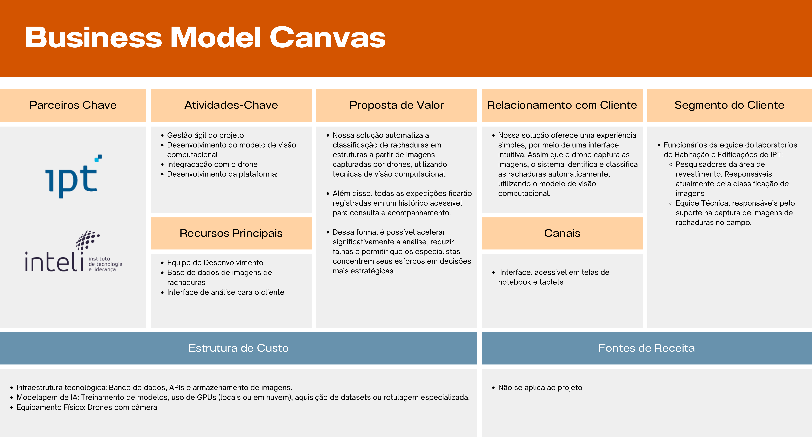

# Business Model Canvas

O Business Model Canvas (BMC) é uma ferramenta de gestão estratégica e empreendedorismo. Ele permite que você descreva, projete, desafie, invente e dinamize seu modelo de negócios (STRATEGYZER, 2025).

Oferecendo uma visão clara, concisa e focada do modelo de negócio, facilitando ajustes rápidos e comunicação com stakeholders. O BMC ajuda a reduzir riscos ao conectar proposta de valor, clientes e receitas, promovendo inovação tanto em startups quanto em grandes empresas.

Para entender melhor se a solução idealizada pela nosso grupo está alinhada com as necessidades do cliente, foi elaborado um Business Model Canvas. A seguir, é possível visualiza-lo

Fonte: Material produzido pelos autores (2025).

## 1.1 Parceitos Chave

IPT e Inteli

## 1.2 Atividades-Chave

- Gestão ágil do projeto: Utilização de sprints semanais para organizar tarefas, revisar entregas e garantir alinhamento entre as equipes.
- Desenvolvimento do modelo de visão computacional: Criação e treinamento de modelo para classificar automaticamente rachaduras em estruturas, a partir de imagens captadas por drones.
- Integração com o drone: Comunicação entre o drone e o sistema de classificação para envio e análise automática das imagens.
- Desenvolvimento da plataforma: Construção do backend, frontend e banco de dados escalável para garantir usabilidade, desempenho e armazenamento seguro dos dados.

## 1.3 Recursos Principais

- Equipe de desenvolvimento
- Base de dados de imagens de rachaduras: Conjunto de imagens rotuladas que alimentam o treinamento e validação do modelo de classificação automática.
- Drone com câmeras de alta definição: Responsável por capturar imagens detalhadas das estruturas de forma automatizada.
- Interface de análise para o cliente: Painel interativo que apresenta os resultados das análises de forma clara.

## 1.4 Proposta de Valor

Nossa solução automatiza a classificação de rachaduras em estruturas a partir de imagens capturadas por drones, utilizando técnicas de visão computacional. Além disso, todas as expedições ficarão registradas em um histórico acessível para consulta e acompanhamento. Atualmente, esse processo é feito manualmente por pesquisadores do IPT, que utilizam seu conhecimento técnico para identificar e classificar os tipos de rachaduras. No entanto, trata-se de uma tarefa repetitiva, demorada e suscetível a erros. Com nossa solução, é possível acelerar significativamente a análise, reduzir falhas e permitir que os especialistas concentrem seus esforços em decisões mais estratégicas.

## 1.5 Relacionamento com Cliente

Nossa solução oferece uma experiência simples e acessível para o cliente, por meio de uma interface intuitiva que facilita o uso da plataforma. Assim que o drone captura as imagens das estruturas, o sistema identifica e classifica as rachaduras automaticamente, utilizando um modelo de visão computacional, sem a necessidade de processos manuais, que são demorados e sujeitos a erros.
Nosso objetivo é oferecer agilidade, precisão nos resultados e incentivando o uso contínuo da solução.

## 1.6 Canais

Interface, acessível em telas de notebook e tablets

## 1.7 Segmento do Cliente

- Funcionários da equipe do laboratórios de Habitação e Edificações do IPT:
    - Pesquisadores da área de revestimento. Responsáveis atualmente pela classificação de imagens
    - Equipe Técnica, responsáveis pelo suporte na captura de imagens de rachaduras no campo.

## 1.8 Estrutura de Custo

- Infraestrutura tecnológica: Banco de dados, APIs e armazenamento de imagens.
- Modelagem de IA: Treinamento de modelos, uso de GPUs (locais ou em nuvem), aquisição de datasets ou rotulagem especializada.
- Equipamento Físico: Drones com câmera

## 1.9 Fontes de Receita

- Não se aplica ao projeto

---

#### Referências:

STRATEGYZER. The Business Model Canvas Strategyzer, 11 fev. 2025. Disponível em: https://www.strategyzer.com/library/the-business-model-canvas. Acesso em: 24 abr. 2025.
